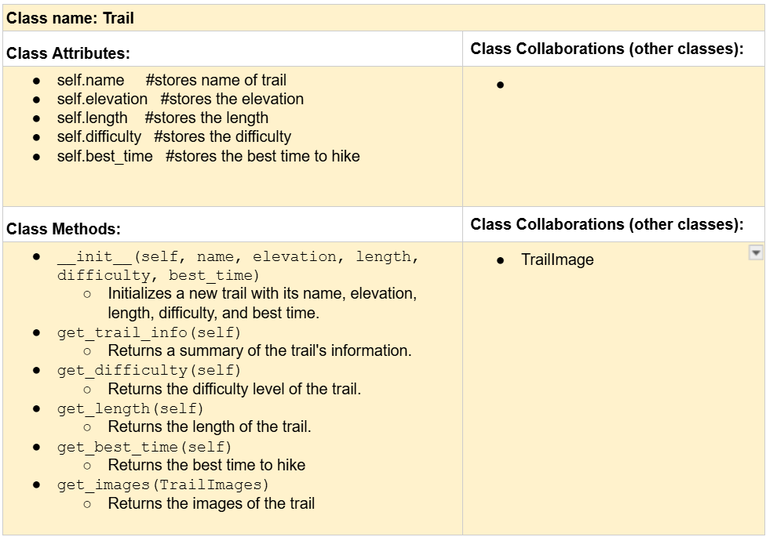
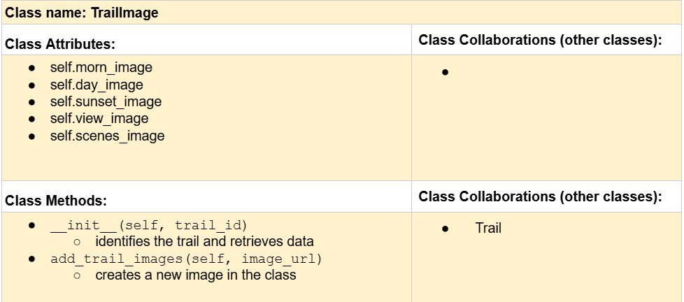
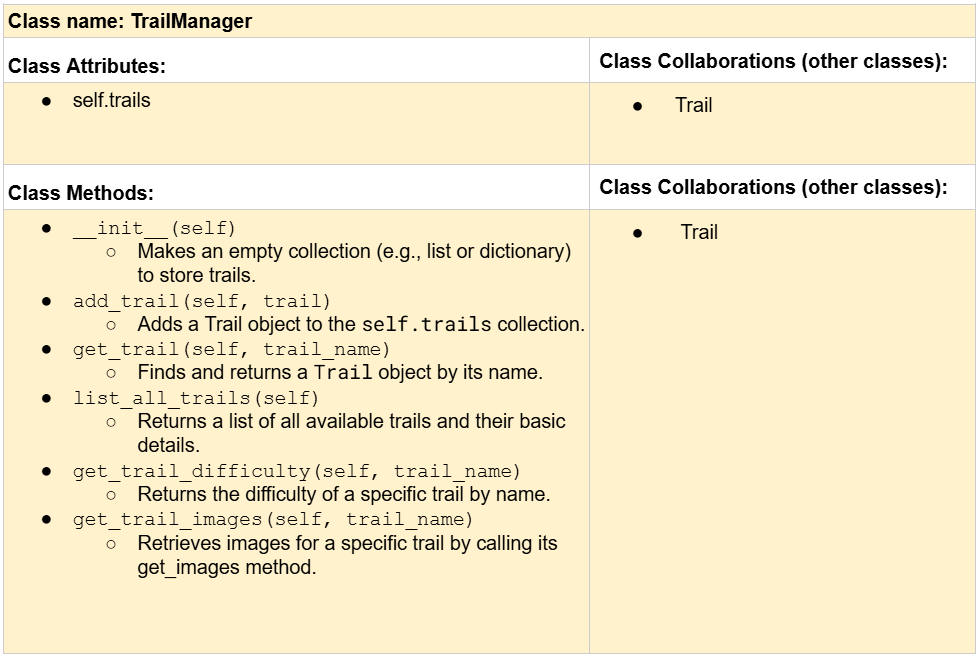

# CSC226 Final Project

**Author(s)**: Utsa Seth

**Google Doc Link**: https://docs.google.com/document/d/1l8k58f-Bypb_HLbgAEDmng6EZDB7yOtM-hvFzO2xUN4/edit?usp=sharing

---

## ️References 
Throughout this project, you have likely used outside resources. Reference all ideas which are not your own, 
and describe how you integrated the ideas or code into your program. This includes online sources, people who have 
helped you, AI tools you've used, and any other resources that are not solely your own contribution. Update as you go.

1. Chat with ChatGPT about CRC cards - https://docs.google.com/document/d/1qAzLseg5_IBE72tHyf0sCF41oJxCDOgJFVrMYBk6vt4/edit?usp=sharing
2. Talked to Nicholas - helped with understanding and conceptualizing the frontend and backend and choosing 
   technologies. Helped point to video resources that explain the creation of a website with python, flask, and sqlite3.
   - https://www.youtube.com/watch?v=m9hUC-WRclU
   - https://youtu.be/c8yHTlrs9EA?si=xZ_JCuMyqw1driLh
3. Link to Google doc with all my references organized by coding language: 
     https://docs.google.com/document/d/1T64b15YVf7ktEUbDqXawRgqRiJiFZQSrJMn5kb4opVo/edit?usp=sharing 
---

## Milestone 1: Setup, Planning, Design

**Title**: `Pinnacle Paths`

**Purpose**: `My project will be an app that allows users to look through the trails at the pinnacles and see images
of different scenic points, trails at different times fo day and in different seasons, 
and learn about the difficulty and hike duration.`

**Source Assignment(s)**: `I will be basing my project off of T12 and T01.`

**CRC Card(s)**:
  - Create a CRC card for each class that your project will implement.
  - See this link for a sample CRC card and a template to use for your own cards (you will have to make a copy to edit):
    [CRC Card Example](https://docs.google.com/document/d/1JE_3Qmytk_JGztRqkPXWACJwciPH61VCx3idIlBCVFY/edit?usp=sharing)
  - Tables in markdown are not easy, so we suggest saving your CRC card as an image and including the image(s) in the 
    README. You can do this by saving an image in the repository and linking to it. See the sample CRC card below - 
    and REPLACE it with your own:





**Branches**: This project will **require** effective use of git. 

Each partner should create a branch at the beginning of the project, and stay on this branch (or branches of their 
branch) as they work. When you need to bring each others branches together, do so by merging each other's branches 
into your own, following the process we've discussed in previous assignments: 

```
    Branch name: sethutsa
```
---

## Milestone 2: Code Setup and Issue Queue

Most importantly, keep your issue queue up to date, and focus on your code. 🙃

Reflect on what you’ve done so far. How’s it going? Are you feeling behind/ahead? What are you worried about? 
What has surprised you so far? Describe your general feelings. Be honest with yourself; this section is for you, not me.

```
    I'm feeling a little behind. I'm trying to make peace with the fact that everyone goes into lots of things in the 
    dark while coding. I'm worried about learning a lot of new things, but also excited to be able to make a functional 
    thing.
```

---

## Milestone 3: Virtual Check-In

Indicate what percentage of the project you have left to complete and how confident you feel. 

**Completion Percentage**: `90%`  

**Confidence**: Describe how confident you feel about completing this project, and why. Then, describe some 
  strategies you can employ to increase the likelihood that you'll be successful in completing this project 
  before the deadline.

```
I feel a lot more confident now. I have a few features I want to add to create more functionality in the
website and use the database for holding difficulty ratings to calculate an average difficulty rating. However, in 
retrospect, the hardest part was knowing where to look and understanding how to connect the frontend and backend using 
flask logic.
```

---

## Milestone 4: Final Code, Presentation, Demo

### User Instructions
When the user hits run, it runs a locally hosted flask application called the 'Pinnacles Navigator.' The purpose of the 
website is to allow the user to look at different trails in the pinnacles, get a glimpse of the view at the top, and 
look at what critters they might find along the way. Each trail page also has buttons that show the connecting trails 
from the summit of that trail. The user can click these buttons to navigate to connected trail pages.
There is also a dropdown widget that asks the user for a difficulty rating and has a placeholder for the average rating. 
However, This is not fully implemented yet. If it was, it would take the user's input which they can submit and 
calculate the difficulty.

### Reflection
In three to four well-written paragraphs, address the following (at a minimum):
- Why did you select the project that you did?
- How closely did your final project reflect your initial design?
- What did you learn from this process?
- What was the hardest part of the final project?
- What would you do differently next time, knowing what you know now?
- (For partners) How well did you work with your partner? What made it go well? What made it challenging?

I selected my project because I wanted to learn web development using a basic website about the pinnacles trails and
their biodiversity. I am really passionate about sharing the beauty of the natural world with people, and it was really
exciting to be able to create a platform to do that. 

My final project somewhat reflected my final design. However, a key element that was missing was the inaturalist API to 
retrieve information directly. I did add and see the potential for other features that I hadn't originally thought of, 
however. For instance, with adding a database to my project, I realized I could store user input. For instance, people's 
reviews or difficulty ratings. I do want to be able to implement these features eventually.

I learned a lot from this process. The first was what it takes to cross the bridge of not understanding anything about
what the scope or implementation for my project was. It made it really easy to procrastinate the project because a lot 
of the initial work was actually researching and understanding different programming languages and technologies. I was 
fortunate to be able to ask lots of questions and even get help with finding useful resources. I learned the start to 
finish process of creating a database using sqlite3, I used python queries to create and update the database. I also 
created my own python classes that used information from the database to create objects without creating an instance of 
the class in the code which was very interesting. Then, I learnt the basic structure of html and css. I relied on AI for 
CSS but understand containers and the method of styling that has the css code within html files. Finally, I used flask 
to create the app routes. I eventually was able to create just two routes and use the same html page for all the trails 
also learning to reuse code as much as possible within what I could grasp. 

As I mentioned above, the hardest part was definitely getting started. If I could do it again, I think I would push 
myself to read and watch videos a lot sooner to understand the technologies. I might also try to use AI to create a 
basic version of what I'm trying to create because I think some of the struggle was also visualizing what all of it 
would really look like. Once I have a basic version, I think it would be a lot easier to implement what I actually want 
and be less daunted by what I don't know. I also wish I had created a simple version of the website sooner so that I 
could've struggled through some more interesting coding or logical problems like storing user input and calculating the 
average. 

